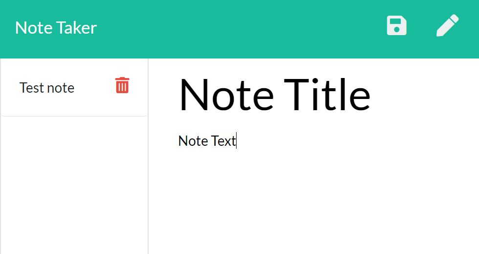

# NoteTaker

### Table of Contents:
1. [Description](#description)
2. [How to install](#How-to-install)
3. [Usage](#Usage)
4. [Contribution Guidelines](#Contribution-Guidelines)
5. [Test instructions](#Test-instructions)
6. [License](#License)
7. [Contact info](#Questions?)

### Description
Stores notes in a JSON file built into the repo. Who needs to store things in SQL anyway.

Deployed at [NoteTaker](https://jordonbobo.github.io/NoteTaker/).

### How to install
I wouldn't bother if I were you. 

### Usage
See discriptiion. Just a way to store info in a JSON file as part of the repo.

### Contribution Guidelines
I did this alone with help from several nice people but the code is original.

### Test instructions
No testing built in. 

### License
This repo is under the MIT license

### Questions?
Feel free to reach out to me with questions. 

[https://www.github.com/JordonBobo](https://www.github.com/JordonBobo) 

